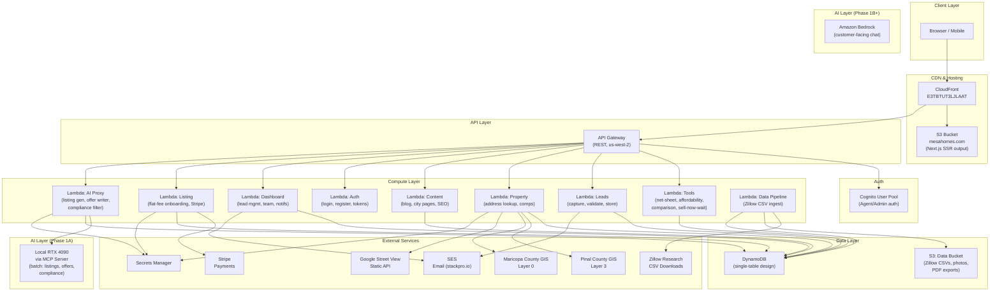
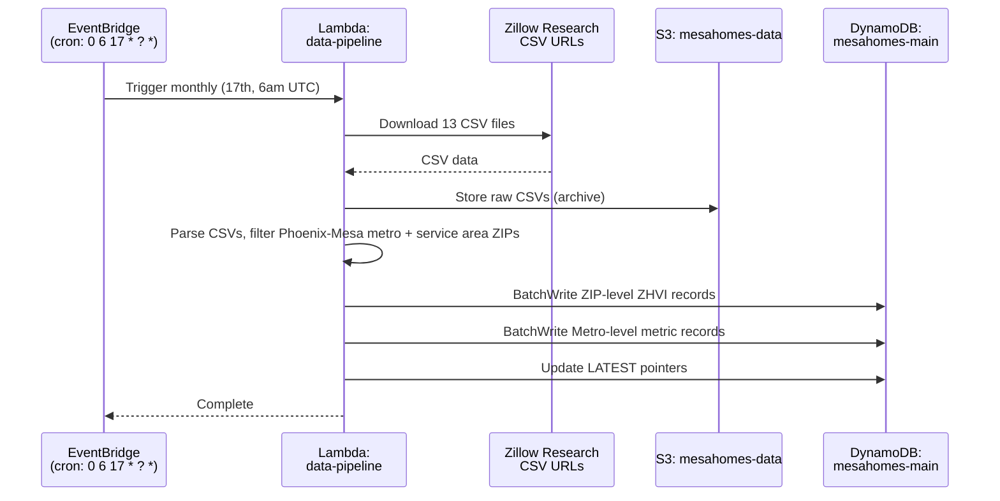
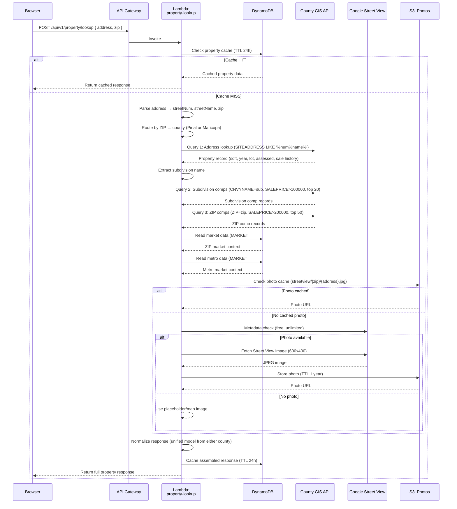
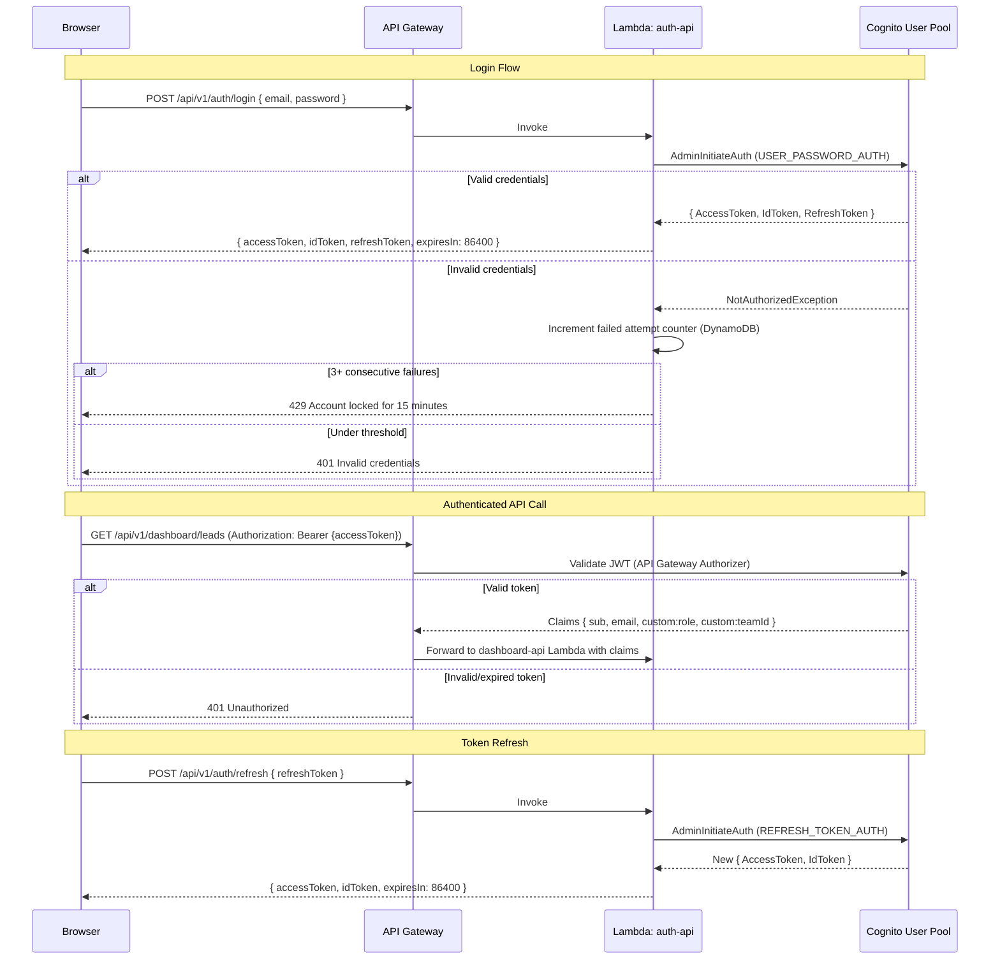
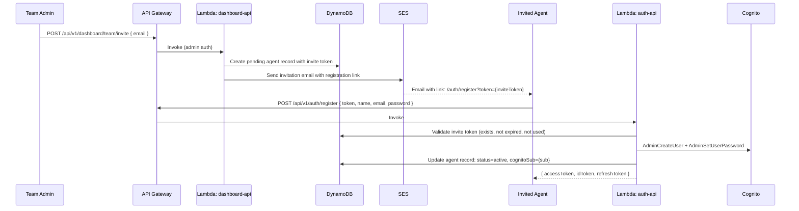

# Design Document: MesaHomes Lead Generation Platform

## Overview

MesaHomes is a serverless, lead-generation-first real estate platform serving the Mesa, AZ metro area. The MVP (Phase 1A) delivers a suite of public-facing buyer and seller tools — each designed around progressive disclosure — that capture leads organically while providing genuine value. The platform runs entirely on AWS serverless infrastructure (Lambda, API Gateway, DynamoDB, Cognito, SES, S3, CloudFront) with a React/Next.js frontend, reusing the existing mesahomes.com domain and CloudFront distribution.

The core architectural insight is that every consumer tool is a lead funnel: visitors receive partial results for free, then provide contact information to unlock the full analysis. This creates a natural exchange of value rather than a gated wall.

**Key design decisions:**
- **Serverless-first**: Lambda + API Gateway + DynamoDB keeps costs near-zero at low traffic and scales automatically.
- **Dual-county data routing**: ZIP-code-based routing directs property lookups to either Pinal County or Maricopa County ArcGIS APIs, with a unified response model that normalizes field differences.
- **Monthly market data pipeline**: Zillow Research CSVs are downloaded monthly via EventBridge-triggered Lambda, parsed, and stored in DynamoDB for sub-second tool responses.
- **Progressive disclosure pattern**: Every tool shows a teaser, then gates the full result behind lead capture — consistent UX across all tools.
- **Phase-forward schema design**: DynamoDB tables use generic partition/sort key patterns (PK/SK) that accommodate Phase 1B (CRM, personalization), Phase 2 (IDX, marketplace, PM portal), and Phase 3 (AI content engine) without table restructuring.

**MVP scope (Phase 1A):** Core funnel pages, 7 consumer tools (net sheet, home value, flat-fee comparison, AI listing generator, AI offer writer, affordability calculator, sell-now-or-wait), guided decision engine, offer guidance/contract education, lead capture system, city/neighborhood pages, blog/SEO, flat-fee listing service, agent auth, lead management dashboard, notifications, and data validation.

---

## Architecture

### High-Level System Architecture



### Request Flow Summary

1. **Static pages**: Browser → CloudFront → S3 (Next.js SSR pre-rendered pages)
2. **API calls**: Browser → CloudFront → API Gateway → Lambda → DynamoDB / External APIs
3. **Auth**: Browser → API Gateway → Cognito (JWT validation) → Lambda
4. **Data pipeline**: EventBridge (monthly cron) → Lambda → Zillow CSV download → S3 → Parse → DynamoDB

### Deployment Architecture

- **Region**: `us-west-2` (primary compute, DynamoDB, Cognito, SES, Secrets Manager)
- **S3 Static**: `us-west-1` (existing bucket for mesahomes.com)
- **CloudFront**: Distribution `E3TBTUT3LJLAAT` with origins for S3 static + API Gateway
- **Domain**: `mesahomes.com` via Route 53 → CloudFront
- **SSL**: Existing ACM certificate

---

## Components and Interfaces

### Frontend: React/Next.js Page Structure

```
/                                   → Homepage ("What do you need?" intent router)
├── /sell                           → Seller landing (flat-fee, full-service, home value)
├── /buy                            → Buyer landing (affordability, first-time, consult)
├── /rent                           → Renter/landlord landing
├── /invest                         → Investor landing
├── /tools/
│   ├── /net-sheet                  → Seller Net Sheet Calculator
│   ├── /home-value                 → Home Value Request Tool
│   ├── /affordability              → Buyer Affordability Calculator
│   ├── /offer-writer               → AI Offer Writer
│   ├── /listing-generator          → AI Listing Description Generator
│   └── /sell-now-or-wait           → Sell Now or Wait Analysis
├── /compare/
│   └── /flat-fee-vs-traditional-agent → Flat-Fee vs Traditional Comparison
├── /areas/
│   ├── /mesa                       → Mesa city page
│   ├── /gilbert                    → Gilbert city page
│   ├── /chandler                   → Chandler city page
│   ├── /queen-creek                → Queen Creek city page
│   ├── /san-tan-valley             → San Tan Valley city page
│   └── /apache-junction            → Apache Junction city page
├── /buy/first-time-buyer           → First-Time Buyer Guide
├── /buy/offer-guidance             → Offer Guidance & Contract Education
├── /blog/                          → Blog listing
│   └── /blog/[slug]                → Individual blog post
├── /reviews                        → Client testimonials
├── /listing/start                  → Flat-Fee Listing onboarding flow
├── /dashboard/                     → Agent Dashboard (auth required)
│   ├── /dashboard/leads            → Lead management
│   ├── /dashboard/leads/[id]       → Lead detail
│   ├── /dashboard/team             → Team management (admin only)
│   ├── /dashboard/performance      → Performance metrics
│   ├── /dashboard/listings         → Flat-fee listing management
│   └── /dashboard/settings         → Notification preferences
└── /auth/
    ├── /auth/login                 → Agent/Admin login
    └── /auth/register              → Agent registration (invite only)
```

**Shared components across all pages:**
- `<FullServiceUpgradeBanner />` — persistent "Switch to Full Service Realtor" CTA
- `<StickyContactBar />` — floating contact button with click-to-call and booking link
- `<LeadCaptureModal />` — reusable progressive disclosure gate
- `<ProgressIndicator />` — guided decision engine step tracker
- `<WhatsNextCard />` — post-tool recommendation for next step in guided path

### API Gateway Routes

All API routes are prefixed with `/api/v1` and served through CloudFront → API Gateway.

#### Public Endpoints (no auth)

| Method | Path | Lambda | Description |
|--------|------|--------|-------------|
| POST | `/api/v1/leads` | leads-capture | Create a new lead (all tools funnel here) |
| POST | `/api/v1/tools/net-sheet` | tools-calculator | Compute seller net sheet |
| POST | `/api/v1/tools/affordability` | tools-calculator | Compute buyer affordability |
| POST | `/api/v1/tools/comparison` | tools-calculator | Flat-fee vs traditional comparison |
| POST | `/api/v1/tools/sell-now-or-wait` | tools-calculator | Sell now or wait analysis |
| POST | `/api/v1/property/lookup` | property-lookup | Address → full property data + comps |
| POST | `/api/v1/property/comps` | property-lookup | Comps by ZIP or subdivision |
| GET | `/api/v1/market/zip/{zip}` | market-data | ZIP-level market data (from Zillow) |
| GET | `/api/v1/market/metro` | market-data | Metro-level market data |
| GET | `/api/v1/content/city/{slug}` | content-api | City page data |
| GET | `/api/v1/content/blog` | content-api | Blog post listing |
| GET | `/api/v1/content/blog/{slug}` | content-api | Single blog post |
| POST | `/api/v1/ai/listing-description` | ai-proxy | Generate MLS listing description |
| POST | `/api/v1/ai/offer-draft` | ai-proxy | Generate offer draft summary |
| POST | `/api/v1/valuation-request` | leads-capture | Submit home value request |
| POST | `/api/v1/booking` | leads-capture | Schedule consultation |
| POST | `/api/v1/listing/start` | listing-service | Start flat-fee listing flow |
| POST | `/api/v1/listing/payment` | listing-service | Process Stripe payment |

#### Authenticated Endpoints (Cognito JWT required)

| Method | Path | Lambda | Auth | Description |
|--------|------|--------|------|-------------|
| GET | `/api/v1/dashboard/leads` | dashboard-api | Agent/Admin | List leads (filtered) |
| GET | `/api/v1/dashboard/leads/{id}` | dashboard-api | Agent/Admin | Lead detail |
| PATCH | `/api/v1/dashboard/leads/{id}` | dashboard-api | Agent/Admin | Update lead status |
| GET | `/api/v1/dashboard/team` | dashboard-api | Admin | Team roster |
| POST | `/api/v1/dashboard/team/invite` | dashboard-api | Admin | Invite agent |
| PATCH | `/api/v1/dashboard/team/{agentId}` | dashboard-api | Admin | Update agent (deactivate) |
| GET | `/api/v1/dashboard/performance` | dashboard-api | Admin | Performance metrics |
| GET | `/api/v1/dashboard/listings` | dashboard-api | Agent/Admin | Flat-fee listings |
| PATCH | `/api/v1/dashboard/listings/{id}` | dashboard-api | Admin | Update listing status |
| GET | `/api/v1/dashboard/notifications/settings` | dashboard-api | Agent | Get notification prefs |
| PUT | `/api/v1/dashboard/notifications/settings` | dashboard-api | Agent | Update notification prefs |
| POST | `/api/v1/auth/login` | auth-api | None | Login (returns JWT) |
| POST | `/api/v1/auth/refresh` | auth-api | None | Refresh token |
| POST | `/api/v1/auth/register` | auth-api | None | Register (invite token) |

### Lambda Function Organization

Lambdas are grouped by domain to balance cold-start performance with code organization:

| Lambda | Runtime | Memory | Timeout | Responsibilities |
|--------|---------|--------|---------|-----------------|
| `leads-capture` | Node.js 20 | 256 MB | 10s | Lead validation, DynamoDB write, SES confirmation, CRM push |
| `tools-calculator` | Node.js 20 | 256 MB | 10s | Net sheet, affordability, comparison, sell-now-or-wait computations |
| `property-lookup` | Node.js 20 | 512 MB | 30s | Address parsing, county routing, GIS queries, Street View, response assembly |
| `market-data` | Node.js 20 | 256 MB | 5s | Read Zillow data from DynamoDB |
| `content-api` | Node.js 20 | 256 MB | 5s | Blog posts, city pages, SEO content |
| `ai-proxy` | Node.js 20 | 512 MB | 30s | Proxy to local RTX 4090 MCP server for listing gen, offer writer, compliance |
| `listing-service` | Node.js 20 | 256 MB | 15s | Flat-fee onboarding, Stripe integration |
| `auth-api` | Node.js 20 | 256 MB | 10s | Cognito auth flows |
| `dashboard-api` | Node.js 20 | 256 MB | 10s | Lead management, team, performance, notifications |
| `data-pipeline` | Node.js 20 | 1024 MB | 300s | Monthly Zillow CSV download, parse, DynamoDB load |
| `notification-worker` | Node.js 20 | 256 MB | 10s | SES email dispatch, retry logic (triggered by DynamoDB Stream) |

---


## Data Models

### DynamoDB Single-Table Design

The platform uses a single DynamoDB table with a generic PK/SK pattern. This supports all current entities and future phases without table proliferation. A GSI on `GSI1PK`/`GSI1SK` enables access patterns like "all leads for an agent" or "all content for a city."

**Table: `mesahomes-main`**

| Attribute | Type | Description |
|-----------|------|-------------|
| PK | String | Partition key (entity-prefixed) |
| SK | String | Sort key (entity-prefixed) |
| GSI1PK | String | Global secondary index partition key |
| GSI1SK | String | Global secondary index sort key |
| GSI2PK | String | Second GSI partition key (Phase 1B+) |
| GSI2SK | String | Second GSI sort key (Phase 1B+) |
| entityType | String | Discriminator: LEAD, AGENT, TEAM, LISTING, CONTENT, MARKET, PROPERTY_CACHE, NOTIFICATION, VISITOR_PROFILE, SAVED_SCENARIO |
| data | Map | Entity-specific payload |
| ttl | Number | TTL epoch (for cache entries) |
| createdAt | String | ISO 8601 timestamp |
| updatedAt | String | ISO 8601 timestamp |

### Entity Key Patterns

#### Lead Records

| Access Pattern | PK | SK | GSI1PK | GSI1SK |
|---------------|----|----|--------|--------|
| Get lead by ID | `LEAD#{leadId}` | `LEAD#{leadId}` | `AGENT#{agentId}` | `LEAD#{createdAt}` |
| Leads by agent (sorted by date) | — | — | `AGENT#{agentId}` | `LEAD#{createdAt}` |
| Leads by status | — | — | `STATUS#{status}` | `LEAD#{createdAt}` |
| Leads by tool source | — | — | `SOURCE#{toolSource}` | `LEAD#{createdAt}` |

**Lead `data` payload:**
```json
{
  "leadId": "uuid",
  "name": "string",
  "email": "string",
  "phone": "string",
  "city": "string",
  "zip": "string",
  "timeframe": "now | 30d | 3mo | 6mo+",
  "leadType": "Buyer | Seller | Renter | Landlord | Investor",
  "leadStatus": "New | Contacted | Showing | Under_Contract | Closed | Lost",
  "toolSource": "net-sheet | home-value | affordability | offer-writer | listing-generator | comparison | first-time-buyer-guide | sell-now-or-wait | ai-chat | direct-consult | full-service-request | flat-fee-listing",
  "tags": ["string"],
  "assignedAgentId": "string | null",
  "financingStatus": "string | null",
  "priceRange": "string | null",
  "toolData": {},
  "pathHistory": [],
  "readinessScore": "number | null",
  "utmSource": "string | null",
  "utmMedium": "string | null",
  "utmCampaign": "string | null",
  "notes": [{ "agentId": "string", "text": "string", "timestamp": "string" }],
  "statusHistory": [{ "status": "string", "timestamp": "string", "agentId": "string" }]
}
```

#### Agent Records

| Access Pattern | PK | SK | GSI1PK | GSI1SK |
|---------------|----|----|--------|--------|
| Get agent by ID | `AGENT#{agentId}` | `AGENT#{agentId}` | `TEAM#{teamId}` | `AGENT#{agentId}` |
| Agents by team | — | — | `TEAM#{teamId}` | `AGENT#{agentId}` |

**Agent `data` payload:**
```json
{
  "agentId": "uuid",
  "cognitoSub": "string",
  "name": "string",
  "email": "string",
  "phone": "string",
  "photoUrl": "string | null",
  "bio": "string | null",
  "role": "Agent | Team_Admin",
  "status": "active | pending | deactivated",
  "teamId": "string",
  "specialties": ["buyer", "seller", "new-construction", "investment", "property-management"],
  "assignedCities": ["string"],
  "assignedZips": ["string"],
  "productionData": { "transactionsClosed": 0, "volume": 0 },
  "notificationPrefs": {
    "newLead": "email | email-sms | none",
    "statusChange": "email | email-sms | none"
  }
}
```

#### Market Data Records (Zillow)

| Access Pattern | PK | SK |
|---------------|----|----|
| ZIP-level home value | `MARKET#ZIP#{zip}` | `ZHVI#{month}` |
| Metro-level metric | `MARKET#METRO#phoenix-mesa` | `{metric}#{month}` |
| Latest ZIP value | `MARKET#ZIP#{zip}` | `ZHVI#LATEST` |
| Latest metro metric | `MARKET#METRO#phoenix-mesa` | `{metric}#LATEST` |

**Market data `data` payload (ZIP):**
```json
{
  "zip": "85140",
  "city": "San Tan Valley",
  "zhvi": 432201,
  "zhviPrevMonth": 433401,
  "zhviChange6Mo": -1200,
  "trendDirection": "declining",
  "month": "2026-03",
  "updatedAt": "2026-03-17T00:00:00Z"
}
```

**Market data `data` payload (Metro):**
```json
{
  "metro": "Phoenix-Mesa-Chandler, AZ",
  "metric": "medianSalePrice",
  "value": 454000,
  "month": "2026-03",
  "updatedAt": "2026-03-17T00:00:00Z"
}
```

#### Property Cache Records

| Access Pattern | PK | SK |
|---------------|----|----|
| Cached property lookup | `PROPERTY#{normalizedAddress}` | `LOOKUP` |
| Cached comps by subdivision | `COMPS#SUB#{subdivision}` | `#{zip}` |
| Cached comps by ZIP | `COMPS#ZIP#{zip}` | `LATEST` |

TTL: 24 hours (86400 seconds from write time)

#### Content Records (Blog, City Pages)

| Access Pattern | PK | SK | GSI1PK | GSI1SK |
|---------------|----|----|--------|--------|
| Blog post by slug | `CONTENT#BLOG#{slug}` | `CONTENT#BLOG#{slug}` | `CONTENT#BLOG` | `#{publishDate}` |
| City page by slug | `CONTENT#CITY#{slug}` | `CONTENT#CITY#{slug}` | `CONTENT#CITY` | `#{slug}` |
| All blog posts (sorted) | — | — | `CONTENT#BLOG` | `#{publishDate}` |

**Blog post `data` payload:**
```json
{
  "slug": "string",
  "title": "string",
  "body": "string (markdown)",
  "author": "string",
  "publishDate": "string (ISO 8601)",
  "category": "string",
  "city": "string | null",
  "zips": ["string"],
  "metaDescription": "string",
  "ogImage": "string | null",
  "tags": ["string"],
  "status": "draft | published | archived"
}
```

#### Flat-Fee Listing Records

| Access Pattern | PK | SK | GSI1PK | GSI1SK |
|---------------|----|----|--------|--------|
| Listing by ID | `LISTING#{listingId}` | `LISTING#{listingId}` | `LISTING#STATUS#{status}` | `#{createdAt}` |

**Listing `data` payload:**
```json
{
  "listingId": "uuid",
  "leadId": "string",
  "propertyAddress": "string",
  "propertyDetails": {},
  "listingDescription": "string",
  "photos": ["string (S3 keys)"],
  "pricingRecommendation": "number | null",
  "status": "draft | payment-pending | paid | mls-pending | active | sold | cancelled",
  "stripePaymentId": "string | null",
  "assignedAdminId": "string",
  "mlsNumber": "string | null",
  "createdAt": "string",
  "updatedAt": "string"
}
```

#### Saved Scenario Records (Guided Decision Engine)

| Access Pattern | PK | SK |
|---------------|----|----|
| Scenario by token | `SCENARIO#{token}` | `SCENARIO#{token}` |
| Scenarios by email | `VISITOR#{email}` | `SCENARIO#{createdAt}` |

**Saved scenario `data` payload:**
```json
{
  "token": "uuid",
  "email": "string",
  "toolType": "net-sheet | affordability | offer-writer | sell-now-or-wait",
  "inputs": {},
  "results": {},
  "pathProgress": {
    "currentPath": "seller | buyer | landlord | investor",
    "completedSteps": ["home-value", "net-sheet"],
    "currentStep": "sell-now-or-wait"
  },
  "createdAt": "string",
  "expiresAt": "number (epoch, 12 months)"
}
```

#### Notification Preference Records

| Access Pattern | PK | SK |
|---------------|----|----|
| Agent notification prefs | `AGENT#{agentId}` | `NOTIF_PREFS` |

### DynamoDB Table Configuration

```
Table: mesahomes-main
  Partition Key: PK (String)
  Sort Key: SK (String)
  Billing: PAY_PER_REQUEST (on-demand)
  
  GSI1:
    Partition Key: GSI1PK (String)
    Sort Key: GSI1SK (String)
    Projection: ALL
  
  GSI2 (provisioned but unused until Phase 1B):
    Partition Key: GSI2PK (String)
    Sort Key: GSI2SK (String)
    Projection: ALL
  
  TTL Attribute: ttl
  
  DynamoDB Streams: NEW_AND_OLD_IMAGES
    → Triggers notification-worker Lambda for lead assignment events
```

---

## Data Pipeline Architecture

### 1. Zillow Research CSV Monthly Ingest



**CSV Processing Logic:**
1. Download all 13 Zillow Research CSVs from `files.zillowstatic.com`
2. Archive raw CSVs to `s3://mesahomes-data/zillow-raw/{YYYY-MM}/`
3. Parse ZIP-level ZHVI CSV: filter rows where `RegionName` matches service area ZIPs (85120-85215, etc.)
4. Parse Metro-level CSVs: filter rows where `RegionName` = "Phoenix-Mesa-Chandler, AZ"
5. Extract the latest month column and previous months for trend calculation
6. Write to DynamoDB with both dated keys (`ZHVI#2026-03`) and `LATEST` pointers
7. Log record counts and any parsing errors to CloudWatch

**Service Area ZIP Codes:**
- Pinal County: 85120, 85121, 85122, 85123, 85128, 85130, 85131, 85132, 85137, 85138, 85139, 85140, 85141, 85142, 85143, 85145, 85172, 85173, 85178, 85191, 85192, 85193, 85194
- Maricopa County (Mesa + surrounding): 85201–85216, 85233, 85234, 85224, 85225, 85226, 85249, 85286, 85295, 85296, 85297, 85298

### 2. Property Lookup Flow (On-Demand)



**County Field Normalization:**

The `property-lookup` Lambda normalizes the different field names from Pinal and Maricopa into a unified response model:

| Unified Field | Pinal County Field | Maricopa County Field |
|--------------|-------------------|----------------------|
| address | SITEADDRESS | PHYSICAL_ADDRESS |
| salePrice | SALEPRICE | SALE_PRICE |
| saleDate | SALEDATE | SALE_DATE |
| sqft | RESFLRAREA | LIVING_SPACE |
| yearBuilt | RESYRBLT | CONST_YEAR |
| assessedValue | CNTASSDVAL | FCV_CUR |
| subdivision | CNVYNAME | SUBNAME |
| ownerName | OWNERNME1 | OWNER_NAME |
| lotSize | STATEDAREA (acres) | LAND_SIZE (sqft) |
| lotSizeUnit | acres | sqft |
| zip | PSTLZIP5 | PHYSICAL_ZIP |
| floors | FLOORCOUNT | null |
| landValue | LNDVALUE | null |
| taxableValue | CNTTXBLVAL | LPV_CUR |
| latitude | null | LATITUDE |
| longitude | null | LONGITUDE |
| zoning | null | CITY_ZONING |
| schoolDistrict | SCHLDSCRP | null |

### 3. Google Street View Photo Caching

```
S3 Bucket: mesahomes-property-photos
  Key pattern: streetview/{zip}/{normalized-address}.jpg
  TTL: 1 year (metadata tag, not S3 lifecycle — photos rarely change)
  
Flow:
  1. Check S3 for existing photo → serve if found (free, instant)
  2. Call Street View Metadata API (free, unlimited) → check status
  3. If status=OK → fetch image (counts against 10K/month free tier)
  4. Store in S3 → serve
  5. If status≠OK → return placeholder map image

Usage monitoring:
  - CloudWatch metric: StreetViewApiCalls (custom)
  - Alarm at 8,000/month (80% of free tier)
  - Target: >90% cache hit rate after 3 months
```

---

## Authentication Flow

### Agent/Admin Authentication (Cognito)



**Cognito User Pool Configuration:**
- Custom attributes: `custom:role` (Agent | Team_Admin), `custom:teamId`
- Password policy: minimum 8 characters, require uppercase, lowercase, number, special character
- Token validity: Access token 24 hours, Refresh token 30 days
- Account lockout: Managed via DynamoDB counter (3 failures → 15 min lock)

**Permission Matrix:**

| Action | Agent | Team_Admin |
|--------|-------|------------|
| View own leads | ✅ | ✅ |
| View all team leads | ❌ | ✅ |
| Update lead status | ✅ (own) | ✅ (all) |
| Invite agents | ❌ | ✅ |
| Deactivate agents | ❌ | ✅ |
| Configure routing rules | ❌ | ✅ |
| View team performance | ❌ | ✅ |
| Manage flat-fee listings | ❌ | ✅ |
| Update notification prefs | ✅ (own) | ✅ (own) |

### Invite-Only Agent Registration



---


## Correctness Properties

*A property is a characteristic or behavior that should hold true across all valid executions of a system — essentially, a formal statement about what the system should do. Properties serve as the bridge between human-readable specifications and machine-verifiable correctness guarantees.*

### Property 1: Net Sheet Calculation Integrity

*For any* valid combination of sale price (> 0), outstanding mortgage (≥ 0), and service type (flat-fee or traditional), the Net Sheet Calculator SHALL produce an output where: (a) all deduction line items (commission, broker fee, title/escrow, transfer taxes, prorated property taxes, mortgage payoff, repair credits) are non-negative, (b) net proceeds = sale price − sum of all deductions, (c) the flat-fee net proceeds ≥ the traditional commission net proceeds for the same sale price and mortgage.

**Validates: Requirements 2.1, 2.2, 2.3**

### Property 2: Affordability Calculator Mathematical Consistency

*For any* valid combination of annual income (> 0), monthly debts (≥ 0), down payment (≥ 0), interest rate (0–15%), and loan term (15 or 30 years), the Affordability Calculator SHALL produce: (a) a maximum purchase price consistent with the computed monthly payment and loan terms, (b) a monthly payment that does not exceed 28% of gross monthly income (front-end DTI), (c) a debt-to-income ratio = (monthly debts + monthly payment) / gross monthly income, and (d) three distinct mortgage scenarios with different parameter values.

**Validates: Requirements 7.1, 7.3**

### Property 3: Flat-Fee vs Traditional Comparison Savings

*For any* estimated sale price > 0, the comparison tool SHALL compute: (a) flat-fee total cost = flat listing fee + $400 broker fee + buyer agent commission, (b) traditional total cost = 5–6% total commission, (c) dollar savings = traditional total − flat-fee total, and (d) savings > 0 for all sale prices where the flat fee is less than the seller's share of a traditional commission.

**Validates: Requirements 4.1, 4.2**

### Property 4: Lead Capture Validation — Required Fields

*For any* lead capture submission missing any required field (name, email, phone, city, timeframe, or leadType), the Lead Capture Service SHALL reject the submission with field-level validation errors identifying each missing field, and SHALL NOT create a Lead record.

**Validates: Requirements 11.2, 11.4, 45.1**

### Property 5: Lead Capture Validation — Field Formats

*For any* lead capture submission containing an invalid email format or invalid phone format, the Lead Capture Service SHALL return a specific error message identifying the invalid field by name, and SHALL NOT create a Lead record.

**Validates: Requirements 45.2, 45.3**

### Property 6: Lead Creation Metadata Correctness

*For any* valid lead capture submission from any tool (net-sheet, home-value, affordability, offer-writer, listing-generator, comparison, first-time-buyer-guide, sell-now-or-wait, direct-consult, full-service-request, flat-fee-listing), the created Lead record SHALL have: (a) the correct `leadType` matching the tool's intent (Seller for seller tools, Buyer for buyer tools), (b) the correct `toolSource` matching the originating tool name, (c) `leadStatus` = "New", (d) a valid ISO 8601 `createdAt` timestamp, and (e) all tool-specific input data preserved in the `toolData` field.

**Validates: Requirements 2.5, 3.3, 5.5, 6.3, 7.4, 11.3**

### Property 7: Lead Data JSON Round-Trip

*For any* valid Lead record (containing all required fields and any combination of optional fields), serializing to JSON and then deserializing back SHALL produce a Lead record deeply equal to the original.

**Validates: Requirements 46.1, 46.2, 46.3**

### Property 8: Service Area ZIP Routing

*For any* property address with a ZIP code, the county routing function SHALL return "pinal" if the ZIP is in the Pinal County ZIP set, and "maricopa" otherwise, and the returned assessor endpoint configuration SHALL contain the correct base URL, field mappings, and query parameters for that county.

**Validates: Requirements 3.1 (address acceptance within service area)**

### Property 9: Property Data Normalization

*For any* raw property record from either Pinal County GIS or Maricopa County GIS, the normalization function SHALL produce a unified response object containing all common fields (address, salePrice, saleDate, sqft, yearBuilt, assessedValue, subdivision, ownerName, lotSize, zip) with correct values mapped from the county-specific field names, and county-specific fields (floors, landValue, zoning, latitude, longitude) populated when available or null when not.

**Validates: Requirements 2.1, 3.1 (property data retrieval)**

### Property 10: AI-Generated Content Compliance Filter

*For any* text string containing one or more Fair Housing Act prohibited terms (discriminatory language related to race, color, religion, sex, national origin, familial status, or disability, or steering language), the Compliance Filter SHALL flag the specific prohibited terms and their locations. *For any* text string containing no prohibited terms, the Compliance Filter SHALL return no flags.

**Validates: Requirements 5.2, 5.3**

### Property 11: AI Output Structural Validity

*For any* valid property details input (bedrooms, bathrooms, sqft, lot size, year built, upgrades, neighborhood), the AI Listing Generator output SHALL be: (a) non-empty, (b) between 100 and 2000 characters, and (c) contain references to at least the bedroom count and bathroom count from the input. *For any* valid offer input (address, price, earnest money, financing type, contingencies, closing date), the AI Offer Writer output SHALL be: (a) non-empty, (b) contain the offered price and closing date, and (c) include the legal disclaimer text.

**Validates: Requirements 5.1, 6.1, 6.4**

### Property 12: Dashboard Lead Query Correctness

*For any* set of leads in the system and any combination of filter criteria (status, type, source, city/ZIP, timeframe, date range, financing status) and sort order (creation date, last updated, status, timeframe urgency), the dashboard query SHALL return exactly the leads matching ALL active filters, in the correct sort order, and an Agent SHALL see only leads assigned to them while a Team_Admin SHALL see all team leads.

**Validates: Requirements 19.1, 19.2, 19.3, 19.5**

### Property 13: Notification Content Completeness

*For any* Lead record, the notification generated for agent assignment SHALL contain: leadType, visitor name, contact method (email or phone), city, timeframe, toolSource, and inquiry summary — all matching the values stored in the Lead record.

**Validates: Requirements 20.3**

### Property 14: Auth Lockout Behavior

*For any* sequence of login attempts for a given account, the auth service SHALL lock the account for 15 minutes after exactly 3 consecutive failed attempts, SHALL allow login on attempts 1 and 2 (if credentials are valid), and SHALL reset the failure counter after a successful login.

**Validates: Requirements 18.3**

### Property 15: Permission Enforcement

*For any* combination of user role (Agent, Team_Admin, unauthenticated) and API endpoint, the auth layer SHALL grant access only when the role has permission per the permission matrix, and SHALL return 401 for unauthenticated requests and 403 for insufficient role permissions.

**Validates: Requirements 18.4, 18.5**

### Property 16: Guided Decision Path Progression

*For any* guided path (seller, buyer, landlord, investor) and any current step within that path, the "What's Next" recommendation SHALL correctly identify the next step in the defined sequence, the progress indicator SHALL accurately show completed steps, the current step, and remaining steps, and the path state SHALL be consistent with the defined path definition.

**Validates: Requirements 48.2, 48.7**

### Property 17: Guided Path Save/Resume Round-Trip

*For any* guided path state (current path, completed steps, current step, tool inputs, tool results), saving the state and resuming via the generated token SHALL restore the exact path state including all tool inputs and results.

**Validates: Requirements 48.3**

### Property 18: Risk Detection in Guided Paths

*For any* visitor scenario containing risk indicators (short sale, estate sale, investment property with tenants, first-time buyer with < 5% down payment), the Guided Decision Engine SHALL detect the risk condition and trigger a Full Service Upgrade prompt. *For any* scenario without risk indicators, no risk-based upgrade prompt SHALL be triggered.

**Validates: Requirements 48.5**

### Property 19: Sell Now or Wait Analysis Uses Correct Market Data

*For any* valid service-area ZIP code, the Sell Now or Wait analysis SHALL incorporate the correct ZIP-level market data (ZHVI, trend direction) and metro-level data (median sale price, days on market, inventory, price cuts percentage) from the DynamoDB market data store, and the analysis output SHALL reference values matching the stored data for that ZIP.

**Validates: Requirements 8.1**

### Property 20: Blog Post SEO Metadata Completeness

*For any* published blog post with title, body, author, date, and category, the rendered page SHALL include: (a) a `<title>` tag, (b) a `<meta name="description">` tag, (c) Open Graph tags (og:title, og:description, og:type), (d) a canonical URL, and (e) JSON-LD structured data with @type "Article".

**Validates: Requirements 16.2**

### Property 21: Sitemap Completeness

*For any* set of published content (blog posts, city pages, neighborhood guides, tool pages), the generated sitemap.xml SHALL contain a `<url>` entry for every published item, and SHALL NOT contain entries for draft or archived content.

**Validates: Requirements 16.3**

### Property 22: Structured Error Response Format

*For any* API error (validation error, internal error, auth error), the response SHALL contain: (a) an `errorCode` string, (b) a human-readable `message` string, and (c) a `correlationId` string matching UUID format, and the HTTP status code SHALL be appropriate for the error type (400 for validation, 401 for auth, 500 for internal).

**Validates: Requirements 45.4**

### Property 23: Offer Guidance Disclaimer Presence

*For any* page within the Offer Guidance and Contract Education section, the rendered content SHALL include the legal disclaimer stating that content is educational only and does not constitute legal advice or a legal document.

**Validates: Requirements 49.4**

---

## Error Handling

### Error Categories and Responses

| Category | HTTP Status | Error Code | Retry | User Message |
|----------|------------|------------|-------|-------------|
| Validation error | 400 | `VALIDATION_ERROR` | No | Field-specific error messages |
| Missing required field | 400 | `MISSING_FIELD` | No | "{field} is required" |
| Invalid format | 400 | `INVALID_FORMAT` | No | "{field} must be a valid {type}" |
| Unauthorized | 401 | `UNAUTHORIZED` | No | "Please log in to continue" |
| Forbidden | 403 | `FORBIDDEN` | No | "You don't have permission for this action" |
| Account locked | 429 | `ACCOUNT_LOCKED` | After 15 min | "Account locked. Try again in 15 minutes" |
| Not found | 404 | `NOT_FOUND` | No | "Resource not found" |
| County GIS timeout | 504 | `UPSTREAM_TIMEOUT` | Yes (auto) | "Property lookup is taking longer than expected. Please try again." |
| County GIS error | 502 | `UPSTREAM_ERROR` | Yes (auto) | "Property data is temporarily unavailable. Please try again." |
| DynamoDB write failure | 500 | `STORAGE_ERROR` | Yes (3x auto) | "Something went wrong. Please try again." |
| Stripe payment failure | 402 | `PAYMENT_FAILED` | No | "Payment could not be processed. Please check your card details." |
| SES email failure | 500 | `NOTIFICATION_ERROR` | Yes (3x auto) | (silent — logged, not shown to user) |
| AI generation timeout | 504 | `AI_TIMEOUT` | Yes (1x auto) | "AI generation is taking longer than expected. Please try again." |
| AI generation error | 500 | `AI_ERROR` | Yes (1x auto) | "AI generation encountered an error. Please try again." |
| Rate limit exceeded | 429 | `RATE_LIMITED` | After backoff | "Too many requests. Please wait a moment." |

### Error Response Format

```json
{
  "error": {
    "code": "VALIDATION_ERROR",
    "message": "One or more fields are invalid",
    "correlationId": "550e8400-e29b-41d4-a716-446655440000",
    "details": [
      { "field": "email", "message": "Must be a valid email address" },
      { "field": "phone", "message": "Must be a valid US phone number" }
    ]
  }
}
```

### Retry Strategy

| Service | Max Retries | Backoff | Circuit Breaker |
|---------|------------|---------|-----------------|
| DynamoDB writes | 3 | Exponential (100ms, 200ms, 400ms) | No |
| County GIS queries | 2 | Linear (1s, 2s) | Yes (5 failures → 60s open) |
| SES email | 3 | Exponential (1s, 2s, 4s) | No |
| Google Street View | 1 | None | Yes (10 failures → 300s open) |
| Stripe API | 0 | N/A (user retries) | No |
| AI proxy (RTX 4090) | 1 | 2s | Yes (3 failures → 30s open) |

### Correlation ID Flow

Every API request generates a UUID correlation ID at the API Gateway level (via `$context.requestId`). This ID is:
1. Passed to all Lambda invocations via the event context
2. Included in all DynamoDB writes as a `correlationId` attribute
3. Included in all CloudWatch log entries
4. Returned to the client in error responses
5. Used to trace a request across Lambda → DynamoDB → SES → external APIs

---

## Testing Strategy

### Dual Testing Approach

The testing strategy combines property-based tests for universal correctness guarantees with example-based unit tests for specific scenarios and integration tests for external service interactions.

### Property-Based Tests

**Library:** [fast-check](https://github.com/dubzzz/fast-check) (JavaScript/TypeScript)

**Configuration:** Minimum 100 iterations per property test.

**Tag format:** Each property test is tagged with a comment referencing the design property:
```
// Feature: mesahomes-lead-generation, Property {N}: {property_text}
```

**Properties to implement (23 total):**

| Property | Module Under Test | Generator Strategy |
|----------|------------------|-------------------|
| 1: Net Sheet Calculation Integrity | `tools-calculator/netSheet` | Random sale prices (50K–5M), mortgages (0–sale price), service types |
| 2: Affordability Calculator Consistency | `tools-calculator/affordability` | Random incomes (20K–500K), debts (0–10K/mo), down payments, rates (1–15%), terms |
| 3: Flat-Fee vs Traditional Savings | `tools-calculator/comparison` | Random sale prices (50K–5M) |
| 4: Lead Validation — Required Fields | `leads-capture/validator` | Random submissions with randomly omitted required fields |
| 5: Lead Validation — Field Formats | `leads-capture/validator` | Random invalid email/phone strings |
| 6: Lead Creation Metadata | `leads-capture/createLead` | Random valid submissions from each tool source |
| 7: Lead JSON Round-Trip | `leads-capture/serializer` | Random lead records with all field combinations |
| 8: ZIP County Routing | `property-lookup/router` | Random ZIP codes (service area + outside) |
| 9: Property Data Normalization | `property-lookup/normalizer` | Random Pinal and Maricopa raw records |
| 10: Compliance Filter | `ai-proxy/complianceFilter` | Random text with/without prohibited terms |
| 11: AI Output Structural Validity | `ai-proxy/listingGen`, `ai-proxy/offerWriter` | Random property/offer inputs |
| 12: Dashboard Lead Query | `dashboard-api/leadQuery` | Random lead sets with random filter/sort combos |
| 13: Notification Content | `notification-worker/formatter` | Random lead records |
| 14: Auth Lockout | `auth-api/loginHandler` | Random login attempt sequences |
| 15: Permission Enforcement | `auth-api/authorizer` | Random role/endpoint combinations |
| 16: Guided Path Progression | `guided-engine/pathEngine` | Random path states |
| 17: Guided Path Save/Resume | `guided-engine/persistence` | Random path states with tool data |
| 18: Risk Detection | `guided-engine/riskDetector` | Random scenarios with/without risk flags |
| 19: Sell Now or Wait Market Data | `tools-calculator/sellNowOrWait` | Random ZIPs with mock market data |
| 20: Blog SEO Metadata | `content-api/renderer` | Random blog post data |
| 21: Sitemap Completeness | `content-api/sitemap` | Random sets of published/draft content |
| 22: Error Response Format | `shared/errorHandler` | Random error types and conditions |
| 23: Offer Guidance Disclaimer | `content-api/offerGuidance` | All offer guidance page types |

### Unit Tests (Example-Based)

Focus areas for example-based unit tests:
- **Tool computations:** Specific known-answer tests (e.g., $400K sale price with $200K mortgage → expected net sheet)
- **Edge cases:** Zero mortgage, maximum sale price, zero income, 0% interest rate, empty inputs
- **UI components:** Progressive disclosure rendering (partial vs full), CTA presence, page structure
- **Content pages:** City page data rendering, blog post rendering, FAQ sections
- **Flat-fee onboarding:** Step sequence, payment flow mocking

### Integration Tests

Focus areas for integration tests:
- **County GIS APIs:** Live queries against Pinal and Maricopa endpoints (1–2 known addresses)
- **Zillow CSV pipeline:** Download, parse, and load a single CSV file
- **Google Street View:** Metadata check for a known address
- **Cognito auth flow:** Login, token refresh, token validation
- **SES email delivery:** Send test email via SES
- **Stripe payment:** Test mode payment flow
- **DynamoDB CRUD:** Write and read each entity type
- **DynamoDB Streams → notification-worker:** Verify stream trigger on lead creation

### Test Environment

- **Unit + property tests:** Run locally and in CI, no AWS dependencies (all external services mocked)
- **Integration tests:** Run against a dedicated test AWS environment with test DynamoDB table, test Cognito pool, and SES sandbox
- **E2E tests:** Cypress or Playwright against deployed staging environment

---

## Phase Accommodation Notes

The design accommodates future phases without restructuring:

### Phase 1B Readiness
- **AI Chat (Req 13):** The `ai-proxy` Lambda already handles AI routing; adding Bedrock chat is a new handler in the same Lambda with a new API route.
- **CRM Routing (Req 14):** The Lead `data` payload already includes all routing metadata (type, city, ZIP, timeframe, financing). The `GSI2PK`/`GSI2SK` on the DynamoDB table is reserved for CRM routing indexes.
- **Personalization (Req 43):** The `VISITOR_PROFILE` entity type and `SAVED_SCENARIO` records are already in the schema.
- **Transaction Tracker (Req 25):** New entity type `TRANSACTION#{transactionId}` fits the single-table pattern. Token-based access uses the same pattern as saved scenarios.

### Phase 2 Readiness
- **IDX Property Search (Req 10):** The frontend page structure has `/search` reserved. The `property-lookup` Lambda can be extended with an IDX data source alongside GIS.
- **Lead Marketplace (Req 23):** New entity type `MARKETPLACE#{listingId}` with GSI for browsing. Stripe integration already exists.
- **PM Portal (Reqs 28–35):** New entity types (PROPERTY, MAINTENANCE, WORK_ORDER, LEASE, VENDOR, OWNER_REPORT) fit the single-table pattern. New Lambda `pm-api` handles all PM endpoints. Auth already supports Property_Owner role.

### Phase 3 Readiness
- **AI Content Engine (Reqs 36–39):** New entity types (CRAWL_RESULT, CONTENT_BRIEF, CONTENT_DRAFT) fit the schema. The `content-api` Lambda extends to support the publishing workflow. The compliance filter already exists for Phase 1A listing descriptions.
